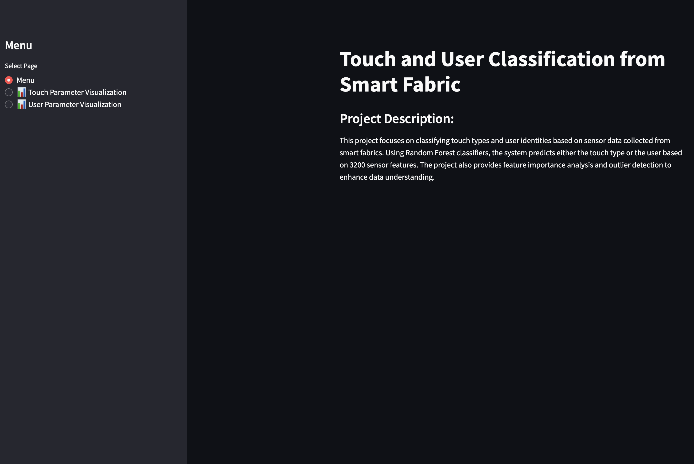
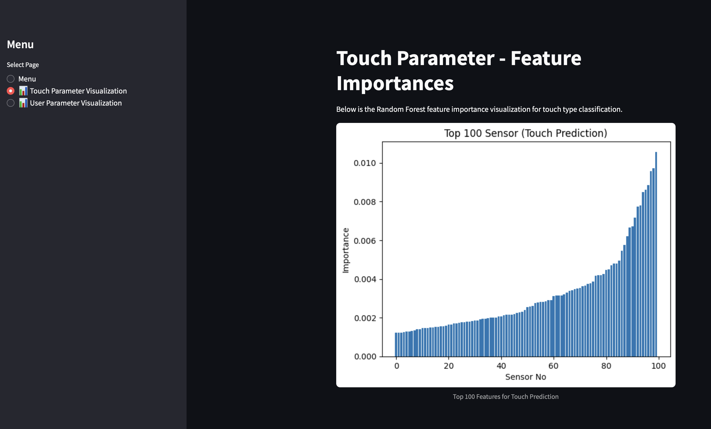
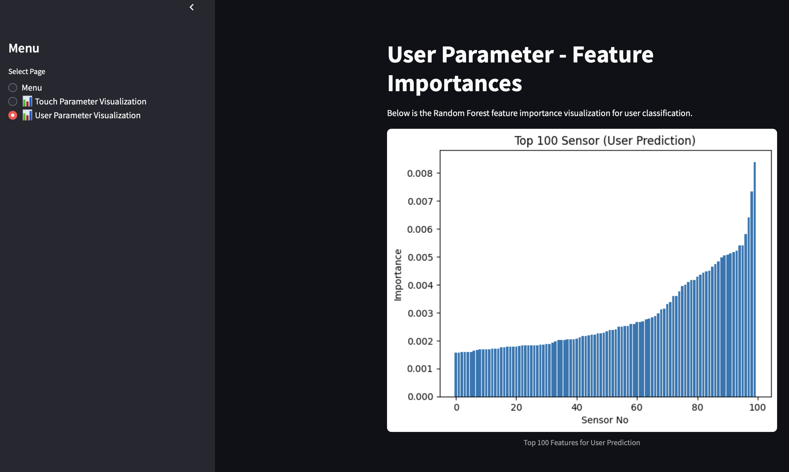

# 🧪 Touch and User Classification from Smart Fabric

This project focuses on classifying **touch types** and **user identities** using sensor data collected from smart fabrics.  
By applying **Random Forest classifiers**, the project predicts either the type of touch or the user ID based on 3200 sensor features.  
It also provides **feature importance visualizations** and prepares the data for **outlier detection**.

---

## 📌 Project Overview

- **Touch Type Prediction:** Classifies different touch gestures based on sensor data.
- **User Identification:** Detects which user interacted with the fabric.
- **Feature Importance Analysis:** Visualizes the top 100 most significant sensor features.
- **Outlier Detection:** Helps identify anomalies in the dataset (currently placeholder).

---

## ⚙️ Technologies Used

- 🐍 Python 3.x
- 📊 Streamlit (for interactive web app)
- 🌲 Scikit-learn (Random Forest classifier)
- 🧮 Pandas, NumPy (data processing)
- 📉 Matplotlib (visualization)

---

## 📂 Installation

1. Clone the repository:
   ```bash
   git clone https://github.com/your-username/touch-user-classification.git
   cd touch-user-classification
   ```

2. Create and activate a virtual environment (optional but recommended):
   ```bash
   python -m venv venv

   # For Linux/Mac:
   source venv/bin/activate

   # For Windows:
   venv\Scripts\activate
   ```

3. Install the required packages:
   ```bash
   pip install -r requirements.txt
   ```

---

## 🚀 How to Run

```bash
streamlit run main.py
```

---

## 🖼️ Demo Screenshots

### 🟢 Menu Page (Project Overview):


### 🟡 Touch Parameter Visualization:


### 🔵 User Parameter Visualization:


---

## 📂 Project Structure

```
├── main.py                                # Streamlit app
├── touch_and_user_classification.py       # ML training and feature importance logic (not called in Streamlit)
├── plot                                   # Visualizations
├── requirements.txt                      # Dependencies
├── README.md                              # Project description (this file)
├── 03-Touch and User Classification from Smart Fabric.xlsx  # Input data (if shared)                            # Touch Parameter Visualization Demo
└── media                            # Program Visualization Demo
```

---

## ⚠️ Notes

- The **PNG visualizations** are pre-generated and displayed directly.
- The **model training part is not triggered** from the Streamlit app. The app is designed for visualization only.

---
